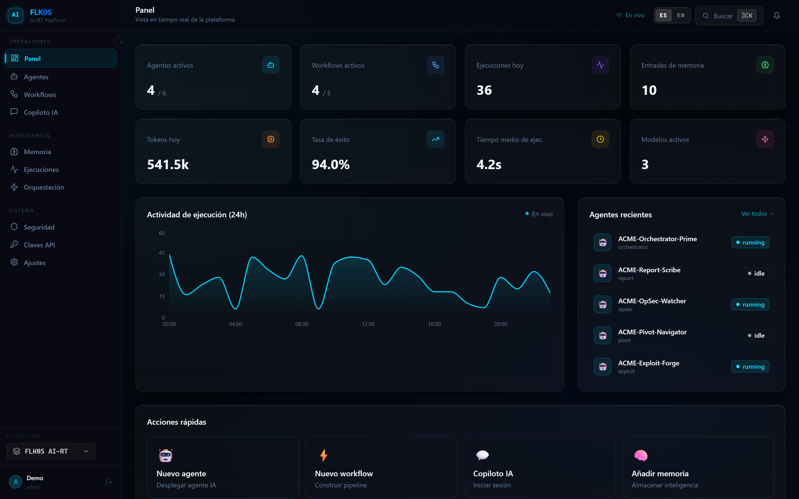
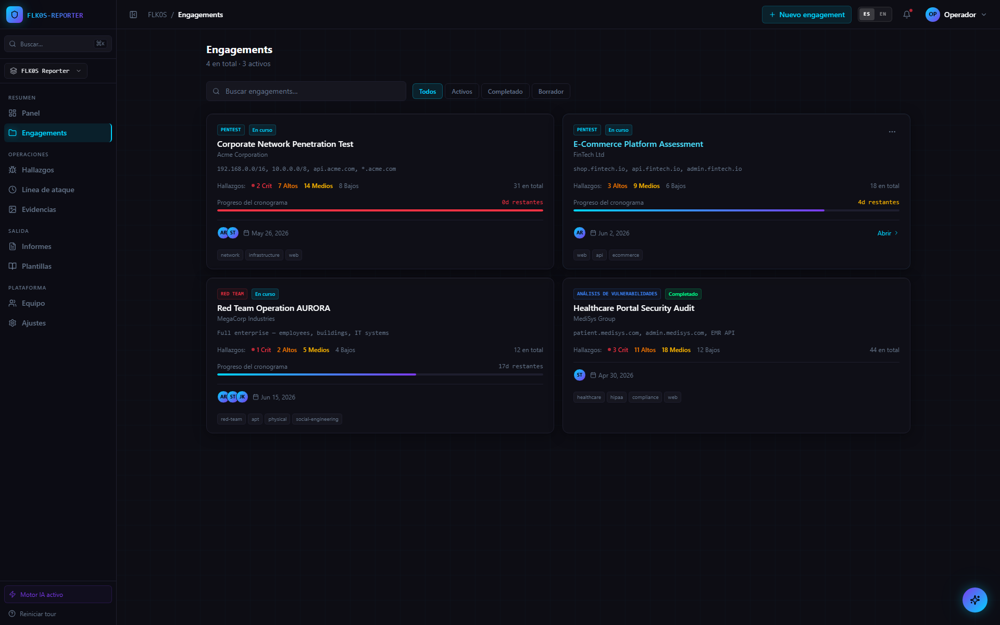
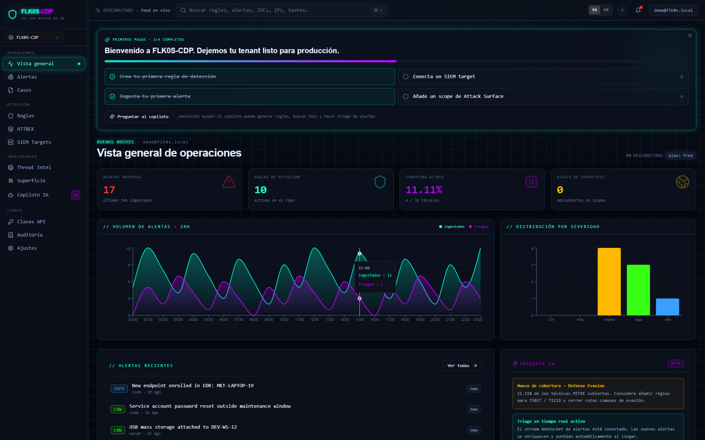
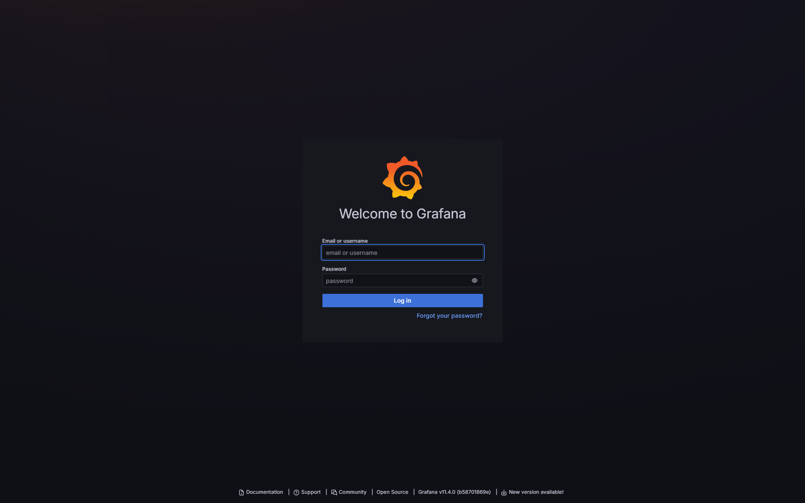
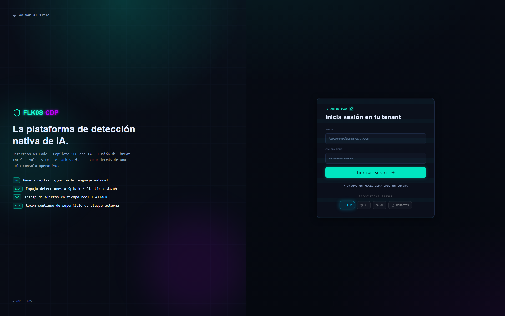

<div align="center">

# FLK0S

### Cybersecurity Operations Platform — un solo ecosistema, no cinco herramientas.

[]()
[]()
[]()
[]()
[]()
[]()

<br/>

**[🌐 Portfolio](https://notsaam.github.io/portfolio/)** &nbsp;·&nbsp; **[💼 LinkedIn](https://www.linkedin.com/in/notsaam)**

[](https://notsaam.github.io/portfolio/)
[](https://www.linkedin.com/in/notsaam)

</div>

---

## ¿Qué es FLK0S?

**FLK0S** es un ecosistema de ciberseguridad construido como una sola plataforma operativa. Cuatro aplicaciones especializadas, un Centro de Operaciones unificado, una identidad compartida, una superficie de observabilidad.

No es un dashboard. No es una colección de tools. Es un **operating system táctico** para equipos de defensa, ofensiva, análisis y reporting.

| Módulo | Propósito | Stack |
|---|---|---|
| **FLK0S-CDP** *(Cyber Defense Platform)* | SOC — alertas, casos, threat intel, response | Next.js · FastAPI · Postgres · ClickHouse · OpenSearch |
| **FLK0S-RT** *(Red Team)* | Operaciones ofensivas — campañas, agentes, lateral movement | Next.js · FastAPI · Postgres · MinIO |
| **FLK0S-AI** *(AI Copilot)* | LLM táctico — investigación IOC, hunting assistance | Next.js · FastAPI · Qdrant · LLM agnóstico |
| **FLK0S-Reportes** | Engagement reports, findings, evidence, deliverables | Next.js · FastAPI · Postgres · MinIO |
| **Centro de Operaciones** *(hub)* | Cockpit maestro: KPIs cross-ecosystem, salud, feed, command palette | Static · cross-app fetch |
| **Auth Gateway** | SSO compartido — JWT issuer, JIT provisioning, audit trail | FastAPI · Postgres · async |

---

## Por qué importa

Los equipos de seguridad operan con un Frankenstein de herramientas desconectadas. Cada una con su login, su modelo de datos, su look-and-feel, su silo de telemetría. FLK0S resuelve eso por construcción:

- **Una identidad** — login en cualquier app, sesión válida en todas (SSO real, no SAML pegado encima).
- **Un lenguaje visual** — severidades, accents, tipografía y motion compartidos por design tokens.
- **Un cockpit** — el hub agrega KPIs, salud y actividad de las 4 plataformas en tiempo real.
- **Un eje de observabilidad** — traces OTel, métricas Prometheus, logs Loki, dashboards Grafana, todo correlacionado.

---

## Arquitectura

```
                      ┌────────────────────────────────────────┐
                      │      Centro de Operaciones (hub)       │
                      │   KPIs · health · feed · Cmd+K         │
                      └────────────────────────────────────────┘
                                       │
              ┌────────────┬───────────┼───────────┬────────────┐
              ▼            ▼           ▼           ▼            ▼
        ┌──────────┐ ┌──────────┐ ┌──────────┐ ┌──────────┐ ┌──────────┐
        │   CDP    │ │    RT    │ │    AI    │ │ Reportes │ │   Auth   │
        │  :3100   │ │   :3200  │ │   :3300  │ │   :3400  │ │   :8000  │
        └────┬─────┘ └────┬─────┘ └────┬─────┘ └────┬─────┘ └────┬─────┘
             │            │            │            │            │
             ▼            ▼            ▼            ▼            ▼
        ┌──────────┐ ┌──────────┐ ┌──────────┐ ┌──────────┐ ┌──────────┐
        │  API:8080│ │ API:8200 │ │ API:8300 │ │ API:8400 │ │ Gateway  │
        │  Postgres│ │ Postgres │ │ Qdrant   │ │ Postgres │ │ Postgres │
        │  ClickH. │ │ MinIO    │ │ Redis    │ │ MinIO    │ │  audit   │
        └──────────┘ └──────────┘ └──────────┘ └──────────┘ └──────────┘
              │            │            │            │
              └────────────┴────────────┴────────────┘
                                       │
                            ┌──────────────────────┐
                            │  Observability Stack │
                            │  OTel · Prometheus   │
                            │   Loki · Tempo · Gr  │
                            └──────────────────────┘
```

Diagramas detallados → [`diagrams/`](./diagrams)

---

## Single Sign-On

Un único `POST /auth/login` en el gateway emite un token con `aud=flk0s:<app>`. La cookie `flk0s_refresh` (HttpOnly, `Domain=.flk0s.local`) viaja entre subdominios → cambias de `cdp.flk0s.local` a `rt.flk0s.local` y la sesión persiste.

```
Browser ──login(email,pwd,audience)──► Gateway ──(JWT aud=cdp + cookie refresh)──► CDP API (200)
                                          │
                                          └──(JWT aud=rt vía /exchange)──► RT API (200)
```

- **JIT provisioning**: si la app destino no conoce al usuario, lo aprovisiona desde los claims del JWT.
- **Audit trail**: `auth_events` registra login_success/failure, token_exchange, logout con IP+UA.
- **Multi-tenant**: organizations + RBAC (owner · admin · lead · analyst · operator · viewer · red_team_lead).
- **Roadmap**: RS256 + JWKS para rotación sin secreto compartido.

Detalle → [`docs/sso.md`](./docs/sso.md)

---

## Capturas

> Las capturas reflejan el estado actual del producto. Datos demo, branding consistente entre apps.

| | |
|:---:|:---:|
|  |  |
| **Centro de Operaciones** — KPIs cross-ecosystem y salud en vivo | **FLK0S-CDP** — pipeline de alertas SOC |
|  |  |
| **FLK0S-RT** — control de campañas y agentes | **FLK0S-AI** — panel de agentes y workflows |
|  |  |
| **FLK0S-Reportes** — engagements y findings | **FLK0S-CDP** — dashboard SOC |
|  |  |
| **FLK0S-RT** — panel de operaciones | **Observabilidad** — Grafana e2e |
|  |  |
| **Login CDP** — accent cian | **Login RT** — accent rojo |

Galería completa → [`screenshots/`](./screenshots)

---

## Stack

| Capa | Tecnologías |
|---|---|
| **Frontend** | Next.js 14 · React 18 · TypeScript · Tailwind · Framer Motion · shadcn/ui · next-intl |
| **Backend** | FastAPI · Pydantic v2 · SQLAlchemy 2 async · asyncpg · Celery |
| **Almacenamiento** | Postgres 16 · Redis 7 · ClickHouse · OpenSearch · Qdrant · MinIO (S3) |
| **Auth** | JWT (HS256 → RS256+JWKS) · cookies HttpOnly · bcrypt · RBAC + scopes |
| **Observabilidad** | OpenTelemetry · Prometheus · Loki · Tempo · Grafana |
| **Infra dev** | Docker Compose · Caddy (TLS local, subdominios) · Playwright e2e |

---

## Demo Mode

El ecosistema arranca con datos demo realistas — nunca pantallas vacías. Una organización (`acme-soc`), tres usuarios (admin/analyst/operator), alertas con severidades mixtas, campañas Red Team en marcha, engagements con findings, IOC pack precargado, agentes IA con conversaciones.

```bash
# Quickstart
./scripts/setup.sh          # detecta docker, genera secrets, arranca stack
./scripts/bootstrap.sh      # corre seeds demo + verifica SSO end-to-end
open https://hub.flk0s.local
```

Login: `demo@flk0s.local` / `FLK0S-demo-2026`

Detalle → [`docs/demo-mode.md`](./docs/demo-mode.md)

---

## Principios de diseño

1. **Premium · operacional · táctico.** Estética SOC, no startup landing. Dark first. Severidades SOC homogéneas (rojo · naranja · ámbar · verde · azul).
2. **Una identidad por usuario, no una por app.** SSO real, JIT, audit por defecto.
3. **Token-agnostic UI components.** Diseño compartido entre 4 paletas distintas mediante inline `hsl()` accents + tokens neutros.
4. **Observabilidad como ciudadano de primera clase.** Cada backend traceado y scrapeado por defecto. No hay servicio sin `/metrics`.
5. **Cada acción audita.** Login, exchange, logout, reset demo — todo aparece en `auth_events` o en logs estructurados.
6. **Plug & play.** El owner instala docker, corre un script y tiene el ecosistema completo en local en <5 minutos.

---

## Roadmap

**Entregado — v1.1**
- ✅ **SSO único** — JWT por audience + token-exchange + JIT provisioning por app
- ✅ **Identidad en Postgres** — orgs, usuarios, RBAC, audit trail y refresh sessions
- ✅ **MFA TOTP** — enrolamiento, verificación y códigos de recuperación
- ✅ **Sesión cross-subdominio** — Caddy + `*.flk0s.local`, login centralizado
- ✅ **Hub con datos vivos** — KPIs, actividad y alertas agregadas en tiempo real
- ✅ **Ticketing unificado** — cross-app, con trazabilidad al origen
- ✅ **Observabilidad e2e** — OpenTelemetry, Prometheus, Grafana, Tempo

**Evolución futura**
- **RS256 + JWKS** — rotación de claves sin secreto compartido
- **SaaS gestionado** — instancia hospedada multi-tenant con SSO externo (OIDC/SAML)
- **CLI `flk0s`** — gestión de tenants / orgs / usuarios desde shell

Detalle → [`docs/roadmap.md`](./docs/roadmap.md)

---

## Documentación

- [`docs/architecture.md`](./docs/architecture.md) — arquitectura del ecosistema
- [`docs/sso.md`](./docs/sso.md) — SSO, JIT, audit
- [`docs/observability.md`](./docs/observability.md) — OTel + métricas + dashboards
- [`docs/demo-mode.md`](./docs/demo-mode.md) — datos demo y presentation mode
- [`docs/networking.md`](./docs/networking.md) — Caddy + subdominios + cookies
- [`docs/quickstart.md`](./docs/quickstart.md) — instalación local end-to-end
- [`docs/design-principles.md`](./docs/design-principles.md) — filosofía de diseño y UX

---

## Estado

| Componente | Estado | Notas |
|---|---|---|
| Auth Gateway | ✅ Operativo | v1.1 · Postgres · SSO · MFA · audit |
| FLK0S-CDP | ✅ Operativo | SOC pipeline · multi-tenant |
| FLK0S-RT | ✅ Operativo | campañas + agentes + infraestructura |
| FLK0S-AI | ✅ Operativo | agentes + workflows + copiloto |
| FLK0S-Reportes | ✅ Operativo | engagements + findings + export |
| Centro de Operaciones | ✅ Operativo | hub cross-app con datos vivos |
| Ticketing unificado | ✅ Operativo | cross-app con trazabilidad |
| Observabilidad | ✅ Operativo | 4 backends instrumentados |
| Networking (Caddy/subdominios) | ✅ Soportado | localhost y enterprise |
| Demo dataset | ✅ Operativo | seed idempotente · reset on-demand |

---

## Autor

Diseñado y desarrollado por **Samu** — arquitectura, identidad/SSO, los cuatro módulos, el Hub,
el ticketing unificado y la capa de observabilidad. Full-stack · security · UX · observabilidad.

🌐 **Portfolio** → https://notsaam.github.io/portfolio/
💼 **LinkedIn** → https://www.linkedin.com/in/notsaam

> *Una plataforma de operaciones de ciberseguridad construida de extremo a extremo.*
> *Disponible para entrevistas técnicas y discusión arquitectónica.*
