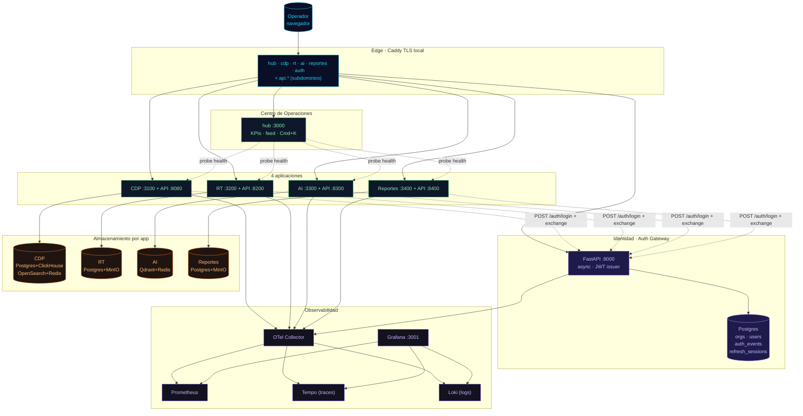

# Diagrama — Arquitectura global

```mermaid
flowchart TB
    classDef edge fill:#0a0e27,stroke:#22d3ee,color:#22d3ee
    classDef identity fill:#1e1b4b,stroke:#a78bfa,color:#c4b5fd
    classDef app fill:#0f172a,stroke:#22c55e,color:#86efac
    classDef data fill:#1f1410,stroke:#f97316,color:#fdba74
    classDef obs fill:#13121f,stroke:#8b5cf6,color:#c4b5fd

    U[("Operador<br/>navegador")]:::edge

    subgraph EDGE["Edge · Caddy TLS local"]
        E["hub · cdp · rt · ai · reportes · auth<br/>+ api.* (subdominios)"]:::edge
    end

    subgraph ID["Identidad · Auth Gateway"]
        GW["FastAPI :8000<br/>async · JWT issuer"]:::identity
        GWDB[("Postgres<br/>orgs · users<br/>auth_events<br/>refresh_sessions")]:::identity
    end

    subgraph HUB_NODE["Centro de Operaciones"]
        HUB["hub :3000<br/>KPIs · feed · Cmd+K"]:::app
    end

    subgraph APPS["4 aplicaciones"]
        CDP["CDP :3100 + API :8080"]:::app
        RT["RT :3200 + API :8200"]:::app
        AI["AI :3300 + API :8300"]:::app
        REP["Reportes :3400 + API :8400"]:::app
    end

    subgraph DATA["Almacenamiento por app"]
        CDP_DB[("CDP<br/>Postgres+ClickHouse<br/>OpenSearch+Redis")]:::data
        RT_DB[("RT<br/>Postgres+MinIO")]:::data
        AI_DB[("AI<br/>Qdrant+Redis")]:::data
        REP_DB[("Reportes<br/>Postgres+MinIO")]:::data
    end

    subgraph OBS["Observabilidad"]
        OTEL["OTel Collector"]:::obs
        PROM["Prometheus"]:::obs
        TEMPO["Tempo (traces)"]:::obs
        LOKI["Loki (logs)"]:::obs
        GRAF["Grafana :3001"]:::obs
    end

    U --> E
    E --> HUB
    E --> CDP
    E --> RT
    E --> AI
    E --> REP
    E --> GW

    HUB -. probe health .-> CDP
    HUB -. probe health .-> RT
    HUB -. probe health .-> AI
    HUB -. probe health .-> REP

    CDP -. POST /auth/login + exchange .-> GW
    RT -. POST /auth/login + exchange .-> GW
    AI -. POST /auth/login + exchange .-> GW
    REP -. POST /auth/login + exchange .-> GW

    GW --> GWDB
    CDP --> CDP_DB
    RT --> RT_DB
    AI --> AI_DB
    REP --> REP_DB

    GW --> OTEL
    CDP --> OTEL
    RT --> OTEL
    AI --> OTEL
    REP --> OTEL
    OTEL --> PROM
    OTEL --> TEMPO
    OTEL --> LOKI
    GRAF --> PROM
    GRAF --> TEMPO
    GRAF --> LOKI
```
