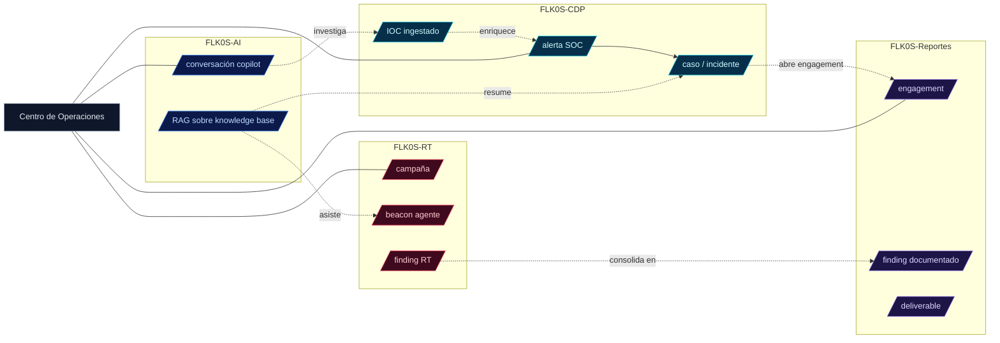

# Diagrama — Flujo de datos entre apps

## Lecturas

- Alertas CDP → casos → engagements en Reportes (kill chain documental).
- IOCs centralizados en CDP, enriquecidos por AI (lookup) y referenciados por RT (atribución) y Reportes (technical detail).
- Hub agrega los 4 ejes como KPIs y feed cross-app.
