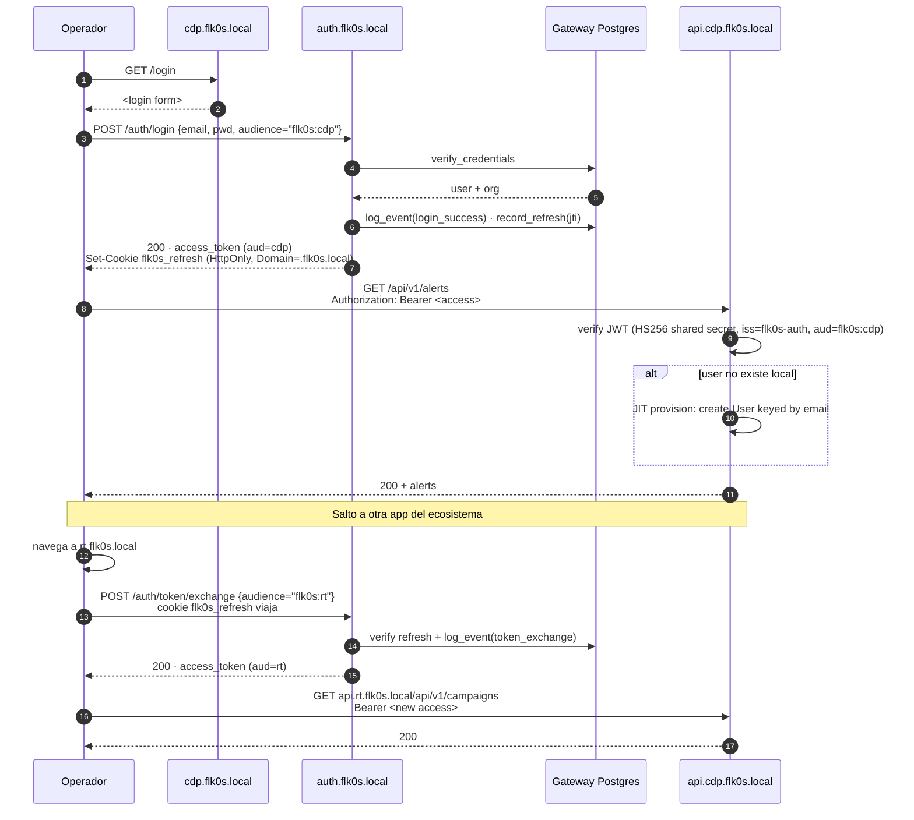

# Diagrama — Flujo SSO

```mermaid
sequenceDiagram
    autonumber
    participant U as Operador
    participant FE as cdp.flk0s.local
    participant GW as auth.flk0s.local
    participant PG as Gateway Postgres
    participant API as api.cdp.flk0s.local

    U->>FE: GET /login
    FE-->>U: <login form>
    U->>GW: POST /auth/login {email, pwd, audience="flk0s:cdp"}
    GW->>PG: verify_credentials
    PG-->>GW: user + org
    GW->>PG: log_event(login_success) · record_refresh(jti)
    GW-->>U: 200 · access_token (aud=cdp)<br/>Set-Cookie flk0s_refresh (HttpOnly, Domain=.flk0s.local)

    U->>API: GET /api/v1/alerts<br/>Authorization: Bearer <access>
    API->>API: verify JWT (HS256 shared secret, iss=flk0s-auth, aud=flk0s:cdp)
    alt user no existe local
        API->>API: JIT provision: create User keyed by email
    end
    API-->>U: 200 + alerts

    Note over U,API: Salto a otra app del ecosistema

    U->>U: navega a rt.flk0s.local
    U->>GW: POST /auth/token/exchange {audience="flk0s:rt"}<br/>cookie flk0s_refresh viaja
    GW->>PG: verify refresh + log_event(token_exchange)
    GW-->>U: 200 · access_token (aud=rt)
    U->>API: GET api.rt.flk0s.local/api/v1/campaigns<br/>Bearer <new access>
    API-->>U: 200
```
