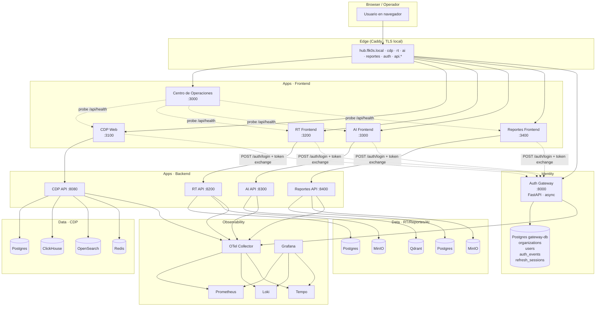

# Arquitectura del ecosistema FLK0S

> Cómo encajan las piezas. Documento canónico — actualizarlo cuando la topología cambie.

## Topología

## Capas

### 1. Edge (Caddy)

Termina TLS local con CA propia. Mapea subdominios a puertos de loopback. Cabeceras de seguridad compartidas (HSTS, X-Frame-Options, Permissions-Policy). Cookie del refresh viaja con `Domain=.flk0s.local` → SSO entre subdominios.

### 2. Identity (Auth Gateway)

FastAPI async. Emite JWTs HS256 firmados con `SECRET_KEY` compartida. Audiences canónicas: `flk0s:cdp`, `flk0s:rt`, `flk0s:airt`, `flk0s:reporter`, `flk0s:shell`.

- `/auth/login` — credenciales + audience → access token + cookie refresh.
- `/auth/token/exchange` — cookie refresh + nueva audience → access token para otra app.
- `/auth/logout` — revoca refresh (denylist + `revoked_at` en Postgres).
- `/auth/me` — introspección del token con cualquier audience.
- `/health` — incluye `store_backend` (memory/postgres).

Persistencia: `organizations` + `users(FK org)` + `auth_events` (audit inmutable) + `refresh_sessions` (jti + revocación + IP + UA).

### 3. Apps (Frontend + Backend × 4)

Cada app es **independiente** — su propio repo, propio docker-compose, propias migraciones. Aceptan dos formas de auth:

1. **Token nativo** (login propio de la app, compatibilidad legacy).
2. **Token del gateway** (HS256, mismo secret, `iss=flk0s-auth`, `aud=flk0s:<app>` → JIT provisioning local si no existe el user).

Esto permite migración progresiva sin romper nada: el day-1 de cada app puede seguir usando su login propio mientras el gateway escala.

### 4. Datos

Cada app tiene su propio stack de datos optimizado a su caso de uso:

- **CDP**: Postgres (transaccional) + ClickHouse (alert events high-volume) + OpenSearch (full-text + IOC search) + Redis (rate-limits + cache).
- **RT**: Postgres + MinIO (S3 para artefactos de campaña).
- **AI**: Qdrant (vector store RAG) + Redis (LLM call cache).
- **Reportes**: Postgres + MinIO (PDFs, evidence files).
- **Gateway**: Postgres dedicado (identity, no se mezcla con datos de apps).

### 5. Observabilidad

OTel Collector recibe traces/metrics/logs de las 4 APIs + gateway, los reparte a Prometheus / Loki / Tempo. Grafana es el panel único. Cada backend tiene `/metrics` con `prometheus-fastapi-instrumentator`.

## Principios arquitectónicos

1. **No fusionar repos.** Cada app evoluciona a su ritmo. El "ecosistema" se materializa en runtime (SSO + UX + observabilidad), no en monorepo.
2. **Separación dura entre identity y datos de app.** Gateway tiene su propia DB. Las apps confían en el JWT, no en su propio campo `users.role`.
3. **Compatibilidad aditiva.** Cada cambio mantiene viva la ruta anterior. JIT no rompe registros previos. Tokens nativos siguen aceptándose junto a tokens del gateway.
4. **Diseño compartido por tokens, no por componente.** Cada app importa el design-system (tipografía, severidades, motion) pero compone con su paleta local. Resultado: coherencia visual sin acoplamiento de código.
5. **Observabilidad por defecto.** No hay servicio sin instrumentación. La capacidad de debugging cross-app es lo que diferencia "ecosistema" de "carpeta con apps dentro".
