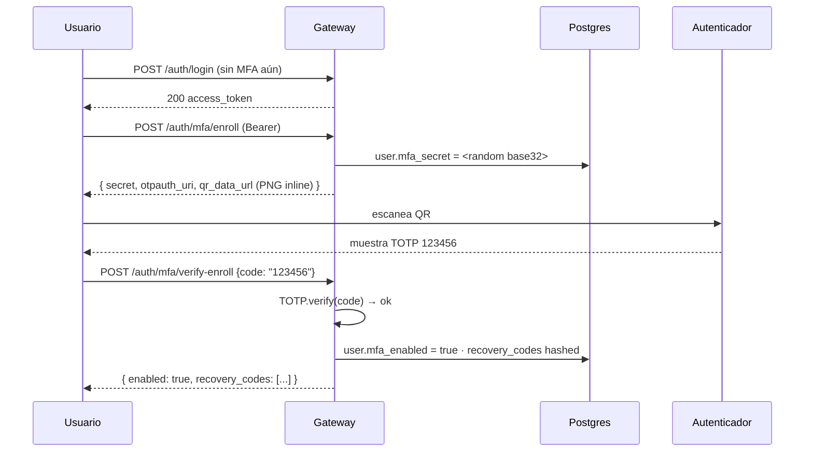
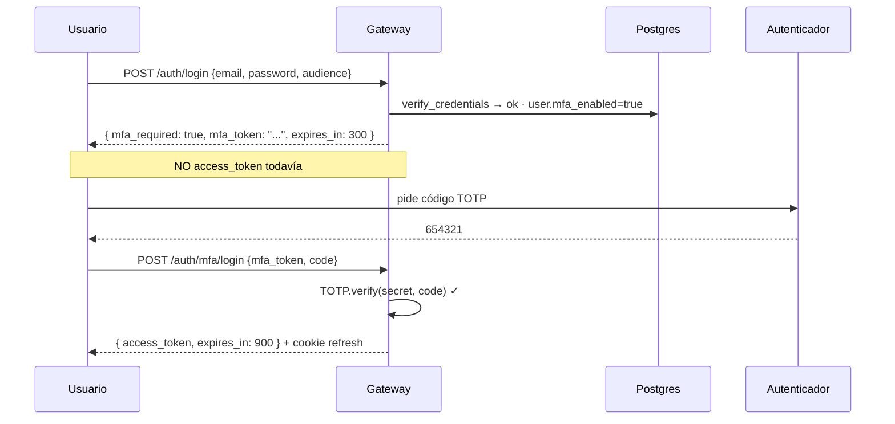

# MFA TOTP en el gateway

> Segundo factor opt-in para usuarios. Compatible con Google Authenticator,
> 1Password, Authy, Bitwarden, YubiKey TOTP, etc.

## Capacidades

- **TOTP RFC 6238** (Time-based One-Time Password, 30s window, ±1 step tolerance)
- **Recovery codes**: 10 códigos AAAA-BBBB single-use generados al enrollment
- **Audit trail**: `mfa_enrolled`, `mfa_challenge`, `mfa_verified`, `mfa_failure`,
  `mfa_recovery_used`, `mfa_disabled` con IP+UA
- **Opt-in per usuario**: si `user.mfa_enabled=false`, login se comporta como siempre

## Flujo enrollment



## Flujo login con MFA activado



## Endpoints

| Método | Path | Auth | Propósito |
|---|---|---|---|
| `POST` | `/auth/mfa/enroll` | Bearer | Genera secret + QR (no enable aún) |
| `POST` | `/auth/mfa/verify-enroll` | Bearer | Confirma código → enable + emite recovery codes |
| `POST` | `/auth/mfa/login` | público | Segundo factor del login (usa mfa_token del challenge) |
| `POST` | `/auth/mfa/disable` | Bearer | Desactiva MFA (exige código TOTP para confirmar) |

## Recovery codes

- 10 códigos AAAA-BBBB generados al enrollment, mostrados al usuario UNA SOLA VEZ
- Persistidos en DB como bcrypt hashes (CSV en `users.mfa_recovery_hashes`)
- Si el usuario pierde el dispositivo, usa un recovery code en `/auth/mfa/login`
  → consume el código (no se puede re-usar) + audit `mfa_recovery_used`
- Cuando se agoten, el usuario puede regenerarlos via /enroll (sobrescribe los previos)

## Audit events

Todos en `auth_events` (Postgres) con IP + UA:

| event | cuándo |
|---|---|
| `mfa_enrolled` | usuario completó verify-enroll |
| `mfa_disabled` | usuario desactivó (con TOTP de confirmación) |
| `mfa_challenge` | login devolvió mfa_required → se emitió mfa_token |
| `mfa_verified` | mfa_token + TOTP válido → sesión emitida |
| `mfa_recovery_used` | sesión emitida con recovery code |
| `mfa_failure` | mfa_token inválido/expirado o código incorrecto |

## Seguridad

- **Secret persistido en DB plaintext** (no hashed). Trade-off conocido: hashearlo
  rompe la verificación TOTP. Mitigación: encripción at-rest (transparente data
  encryption del Postgres) + acceso restringido a la DB.
- **Recovery codes hashed** con bcrypt (no recuperables, sólo verificables).
- **Challenge tokens en memoria** del gateway proceso. TTL 5min. Restart del
  gateway invalida todos los pendientes (esperable; usuario re-hace login).
- **Rate limiting** sobre /auth/mfa/login recomendado (hereda del rate limit
  general del gateway si está configurado en Caddy / reverse proxy).
- **Brute-force resistance**: TOTP ±1 window + 30s steps = ~3 intentos/min.
  Recovery codes con 80 bits entropy + bcrypt = inquebrante en práctica.

## Apps cliente (frontend)

El SDK `@flk0s/auth-sdk` debe manejar la respuesta de `/auth/login`:

```ts
const res = await fetch("/auth/login", { ... });
const body = await res.json();
if ("mfa_required" in body) {
  // Mostrar UI de segundo factor con mfa_token guardado
  const code = await promptUser();
  const final = await fetch("/auth/mfa/login", {
    method: "POST",
    body: JSON.stringify({ mfa_token: body.mfa_token, code }),
  });
  return final.json();   // { access_token, expires_in }
}
return body;   // { access_token, expires_in }  — sin MFA
```

## Roadmap MFA

- ✅ TOTP enrollment + verify + login challenge + recovery codes + disable
- ✅ Audit events completos
- ✅ Migración in-line idempotente de columnas
- ⏳ Rate-limit dedicado en /auth/mfa/login (5 intentos/15min)
- ⏳ WebAuthn / passkeys (futuro)
- ⏳ Backup TOTP secret rotation
- ⏳ UI front-end de enrollment (modal en /settings de cada app)
