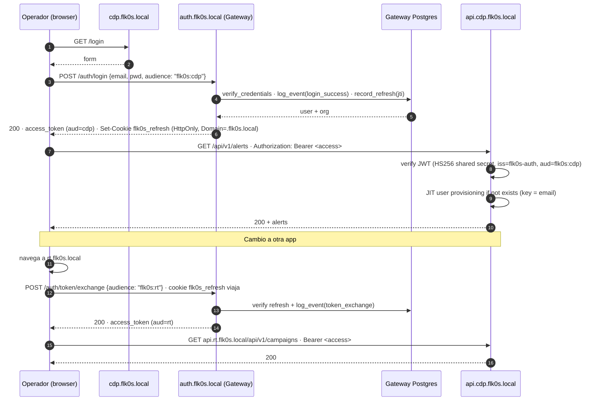

# FLK0S — Single Sign-On

> Cómo una sola identidad funciona en 4 apps independientes, sin federar SAML por encima.

## Flujo end-to-end



## Componentes

### Tokens

| Tipo | Audience | TTL | Storage |
|---|---|---|---|
| **Access** | `flk0s:<app>` (cdp/rt/airt/reporter) | 15 min | Memoria del frontend |
| **Refresh** | `flk0s:*` | 14 días | Cookie HttpOnly · `Domain=.flk0s.local` · `SameSite=Lax` · `Secure` en prod |

Algoritmo actual: **HS256** con secret compartida ecosystem-wide. Roadmap: **RS256 + JWKS**.

### JIT Provisioning

Cuando una app recibe un token válido del gateway para un usuario que no existe en su DB local, lo crea on-the-fly:

```python
# Pseudocódigo común a las 4 apps
def get_current_user(token):
    claims = verify_gateway_token(token)  # HS256, iss, aud
    user = find_local_user(email=claims["email"])
    if not user:
        user = create_local_user(
            email=claims["email"],
            name=claims["name"],
            role=claims["role"],
            org_id=claims.get("org_id"),
        )
    return user
```

Cada app maneja JIT a su modelo:

- **CDP**: multi-tenant. JIT crea `Organization` + `User` con UUIDs locales, mapeados por email.
- **RT**: JIT genera handle único `{base}-{uuid[:6]}`.
- **AI**: stateless — no JIT, identidad derivada directamente de claims.
- **Reportes**: JIT por email/sub.

### Audit trail

Cada evento de auth queda registrado en `auth_events`:

| Evento | Campos | Cuándo |
|---|---|---|
| `login_success` | user_id, email, audience, ip, ua | login OK |
| `login_failure` | email, audience, ip, ua, detail | credenciales mal |
| `token_exchange` | user_id, audience, ip, ua | cambio de app via refresh |
| `exchange_failure` | email, audience, ip, ua, detail | refresh roto o user inexistente |
| `logout` | user_id, ip, ua, jti | logout explícito |

Adicionalmente `refresh_sessions(jti)` mantiene cada refresh emitido con `issued_at / expires_at / revoked_at / ip / user_agent` para análisis y revocación selectiva.

## Modelos de datos (gateway)

```sql
organizations(id PK · slug uniq · name · is_active · created_at)
users(id PK · email uniq · name · hashed_password · role · organization_id FK · last_login_at · created_at)
auth_events(id PK · event · user_id · email · audience · ip · user_agent · detail · at)
refresh_sessions(jti PK · user_id · issued_at · expires_at · revoked_at · ip · user_agent)
```

Roles canónicos: `owner · admin · lead · engineer · analyst · operator · viewer · red_team_lead`. Permisos vía `scope[]` opcional en el JWT (`read:*`, `write:rules`, etc.) — defaults por rol están definidos en el SDK cliente como fallback UX.

## Modos de ejecución

### Modo "dev por puerto" (sin Caddy)

- Cada app accesible en `http://localhost:31xx`.
- AppSwitcher funciona (links absolutos).
- Cookie cross-app NO viaja (diferentes orígenes).
- El JWT del gateway sigue funcionando por header `Authorization` — el SDK lo cachea en memoria + sessionStorage.

### Modo "gateway" (Caddy + subdominios)

- Cada app accesible en `https://<app>.flk0s.local`.
- Cookie `flk0s_refresh` con `Domain=.flk0s.local` viaja a las 5 apps.
- SSO de navegador completo: cambio de subdominio → sesión preservada.
- Requisitos: Caddy + entrada en hosts + `caddy trust` para CA local.

Detalle setup → [`networking.md`](./networking.md)

## Estado de implementación

| Fase | Descripción | Estado |
|---|---|---|
| 1 | SECRET_KEY compartida + apps aceptan JWT del gateway + JIT | ✅ verificado |
| 2 | Postgres del gateway + orgs/users/audit/refresh_sessions + bootstrap idempotente | ✅ verificado |
| 3 | Caddy + subdominios + cookies cross-subdomain + login delegado al gateway en cada app | 🚧 owner setup |
| 4 | RS256 + JWKS (rotación sin secret compartido) | ⏳ pendiente |

## Garantías

- **Compatibilidad aditiva**: los logins propios de las apps siguen activos. Roll-back instantáneo = no usar el gateway.
- **Sin SPOF de identidad** *(en modo dev por puerto)*: cada app tiene su propio store y puede operar standalone.
- **Auditable**: cada login deja trazo. Cada refresh rota. Logout revoca por jti.
- **Multi-tenant by design**: la org del usuario viaja en el token; las apps multi-tenant filtran por ella.

## Lo que NO hace (todavía)

- No federa con IdPs externos (Okta, Azure AD, Google Workspace). Roadmap.
- HS256 implica que comprometer una app compromete el ecosistema (rotación = downtime). Roadmap → RS256+JWKS.
- No tiene MFA. Roadmap (TOTP primero, WebAuthn después).
- Reporter aún no expone `/login` propio — entra vía gateway directamente o token nativo legado.
